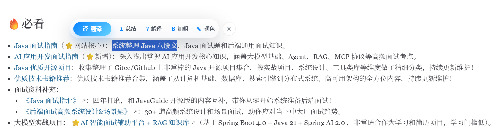
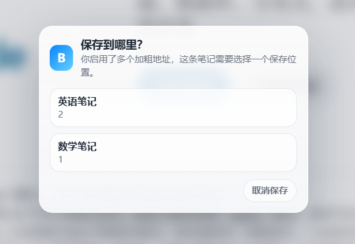
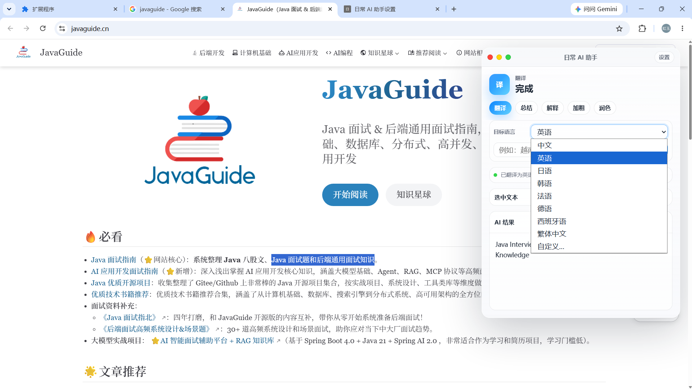
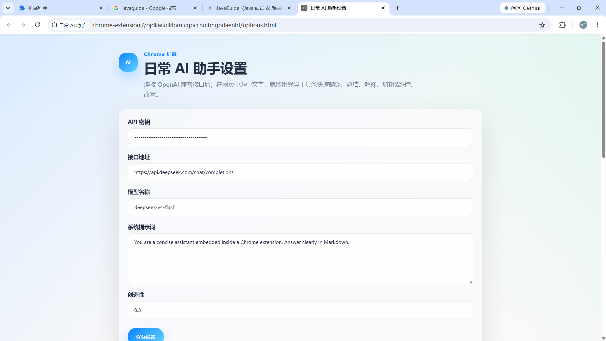
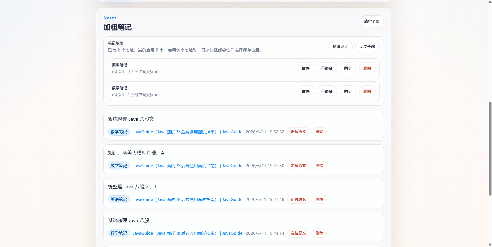

# 日常 AI 助手

一个面向日常网页阅读的 Chrome 扩展。选中网页文字后，插件会在当前页面弹出 macOS 风格的轻量工具条，支持翻译、总结、解释、润色，以及本项目最核心的能力：把重要文字直接加粗并保存成可回溯的笔记。

这个项目的重点不是做一个“大而全”的 AI 工具，而是解决阅读网页时一个很具体的问题：看到重要内容时，既能立刻标记下来，又能在之后从笔记精准回到原文位置。

## 项目亮点

- **加粗即笔记**：在网页中选中文字后点击 `加粗`，文字会直接在原网页中变粗，同时自动保存为笔记。
- **回到原文精确位置**：在设置页的加粗笔记列表中点击 `定位原文`，插件会打开来源网页，自动滚动到原文附近，并用醒目的黄色高亮标出原文。
- **多笔记地址管理**：可以添加多个加粗笔记地址，例如 `英语学习`、`论文摘录`、`产品灵感`。每个地址都可以启用、暂停、重命名、同步或删除。
- **多地址保存选择**：如果同时启用了多个笔记地址，每次加粗时都会弹出选择器，让用户决定这条笔记保存到哪里。
- **无 API 也可使用核心功能**：加粗、保存笔记、查看笔记、定位原文都不依赖 API Key。只有翻译、总结、解释、润色等 AI 功能需要配置模型接口。
- **当前页侧边栏体验**：AI 结果不会跳转到新页面，而是在当前网页右侧打开 macOS 风格面板，阅读上下文不会被打断。
- **选择完成后再弹出工具条**：工具条只在鼠标松开、选中文字完成后出现，避免拖选过程中反复弹出。

## 真实截图

以下截图来自插件的真实使用过程，展示了从网页划词、加粗保存、AI 处理到笔记管理的完整体验。

### 选中文字后的悬浮工具条

选中网页文字后，工具条会在原文附近出现，可以快速翻译、总结、解释、加粗或润色。



### 多个笔记地址的保存选择

当启用了多个加粗笔记地址时，点击 `加粗` 后会弹出保存位置选择器，方便把不同内容放进不同笔记文件。



### 当前页面右侧 AI 面板

翻译、总结、解释、润色等 AI 功能会在当前网页右侧显示结果，不需要跳转到新页面。



### 设置页与 API 配置

设置页用于配置 OpenAI 兼容接口，例如 DeepSeek API。加粗笔记功能不依赖 API Key，AI 功能才需要配置。



### 加粗笔记与多地址管理

设置页可以查看所有加粗笔记、按地址区分笔记、同步 Markdown 文件，并通过 `定位原文` 回到网页原文位置。



## 功能概览

### 网页快捷工具条

选中任意网页文字后，插件会显示悬浮工具条：

- `翻译`：自动识别原文语言，支持翻译到常见语言，也支持自定义目标语言。
- `总结`：提炼一句话概括、关键要点和值得记住的信息。
- `解释`：解释术语、复杂句子或陌生概念。
- `加粗`：本地能力，不需要 API。将选中文字加粗并保存到加粗笔记。
- `润色`：把选中文字改写得更自然、清楚、礼貌。

右键菜单仍然保留为备用入口。

### 加粗笔记

每条加粗笔记会保存：

- 选中的原文内容
- 来源网页标题
- 来源网页链接
- 加粗日期
- 保存到的笔记地址

在设置页中可以统一查看所有加粗笔记，并支持：

- `定位原文`：打开来源网页并高亮原文
- `删除`：删除单条笔记
- `清空全部`：清空本地保存的所有加粗笔记

### 笔记地址

在设置页的 `笔记地址` 区域可以添加多个保存地址。每个地址对应一个本地文件夹，并会同步成一个 Markdown 文件。

例如：

```text
英语学习.md
论文摘录.md
产品灵感.md
```

每个地址支持：

- `启用 / 暂停`
- `重命名`
- `同步`
- `删除`

当没有启用任何笔记地址时，笔记仍会保存在扩展本地存储中，不会丢失。

## 使用方式

### 1. 安装扩展

1. 打开 Chrome。
2. 进入 `chrome://extensions`。
3. 开启右上角的 `开发者模式`。
4. 点击 `加载未打包的扩展程序`。
5. 选择本项目文件夹。

### 2. 使用加粗笔记

1. 打开任意网页。
2. 选中一段你觉得重要的文字。
3. 松开鼠标后等待工具条出现。
4. 点击 `加粗`。
5. 如果启用了多个笔记地址，选择这条笔记要保存到哪个地址。
6. 之后可以在设置页的 `加粗笔记` 中查看这条记录。

### 3. 从笔记回到原文

1. 点击扩展图标，进入设置页。
2. 找到 `加粗笔记` 列表。
3. 点击某条笔记旁边的 `定位原文`。
4. 插件会打开来源网页，自动滚动到原文位置，并用黄色高亮标出。

这个功能适合用在文章阅读、论文阅读、文档学习、资料整理、竞品分析等场景。

## AI 功能配置

加粗笔记不需要 API Key。只有 `翻译`、`总结`、`解释`、`润色` 需要配置 OpenAI 兼容的 Chat Completions 接口。

如果没有填写 API Key，插件不会直接报错，而是在右侧面板提示用户去设置页填写。

### DeepSeek 配置示例

`接口地址`：

```text
https://api.deepseek.com/chat/completions
```

`模型名称`：

```text
deepseek-v4-flash
```

填写 API Key 后点击 `保存设置` 即可。

## 技术实现

项目基于 Chrome Extension Manifest V3 实现，主要文件如下：

```text
manifest.json   扩展清单配置
background.js   后台脚本，负责右键菜单、AI 请求和设置页跳转
content.js      内容脚本，负责网页工具条、右侧面板、加粗、原文定位
options.html    设置页结构
options.css     设置页样式
options.js      设置页逻辑、笔记列表、多地址管理和文件同步
```

核心技术点：

- 使用 `content_scripts` 在网页中注入工具条和右侧面板。
- 使用 Shadow DOM 隔离插件 UI，减少与目标网页样式冲突。
- 使用 `chrome.storage.local` 保存加粗笔记和笔记地址配置。
- 使用 `chrome.storage.sync` 保存 API 配置。
- 使用 File System Access API 保存多个本地 Markdown 笔记文件。
- 使用 IndexedDB 保存文件夹句柄，支持后续同步。
- 使用 `window.find` 和文本节点遍历实现原文查找与高亮定位。
- 使用 OpenAI 兼容的 Chat Completions 接口实现 AI 功能。

## 为什么这个插件有价值

很多网页 AI 插件会把重点放在“问 AI”上，但真实阅读中更常见的需求是：

- 我想快速标出这句话。
- 我想之后还能找到它来自哪里。
- 我想把不同主题的摘录放到不同地方。
- 我不希望每次做笔记都复制、打开文档、粘贴、再补来源。

这个插件把这些动作压缩成了一个很自然的流程：

```text
选中文字 -> 加粗 -> 自动保存来源 -> 后续一键回到原文
```

它更像一个轻量的网页阅读笔记系统，而不是单纯的 AI 弹窗工具。

## 后续可扩展方向

- 为加粗笔记增加标签和搜索。
- 支持按网站、时间、笔记地址筛选。
- 支持导出全部笔记为 Markdown / JSON。
- 支持把加粗笔记同步到 Notion、Obsidian 或其他知识库。
- 为定位原文增加更强的模糊匹配能力，应对网页内容更新。
- 增加截图区域或网页快照，帮助保留上下文。

## 项目状态

当前项目已经实现核心功能，可作为本地 Chrome 扩展使用。真实截图、演示 GIF、产品封面图可以根据后续展示需要自行补充。
